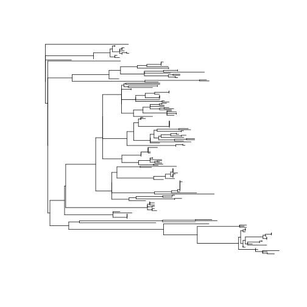
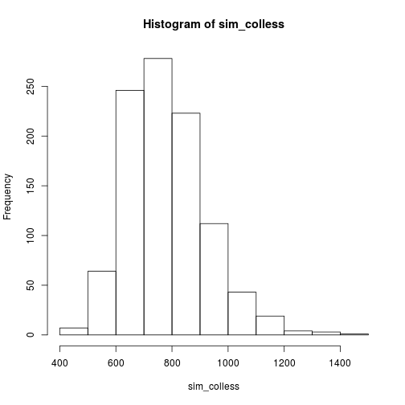

## R setup

Install [apTreeshape](https://cran.r-project.org/package=apTreeshape).

```r
install.packages("apTreeshape")
```

## Playing with your tree in R


```r
library(apTreeshape)
```

Load the tree into R with the `read.tree` function of [ape](https://cran.r-project.org/package=ape/):

```r
t = read.tree('../data/processed/measles.nwk')
```

We can see that the tree is unrooted, which is the norm for doing phylogenetic analysis with reversible models.

The next step is to root the tree at a specific leaf:

```r
r = root(t, "AF410972|Montreal/CAN|1979", resolve.root = TRUE)
plot(r, show.tip.label=FALSE)
```



Now we can calculate the Colless tree shape statistic for our inferred tree:


```r
true_colless = colless(as.treeshape(r))
true_colless
```

```
## [1] 911
```

Now we can compare it with 1000 simulations of a neutral process:


```r
n_sims = 1000
sim_colless = sapply(rtreeshape(n_sims, length(r$tip.label), model="yule"), colless)
hist(sim_colless)
```



Does the observed imbalance appear unusual?
For a more quantitative comparison:


```r
sum(true_colless > sim_colless) / n_sims
```

```
## [1] 0.831
```


## Exercise: repeat tree shape analysis with flu tree

1. Load flu tree (`../data/processed/flu.nwk`) into R
2. Pick an appropriate sequence with which to root the tree
3. Make a tree shape object and calculate the Colless statistic
4. How does it compare to the simulated trees?
